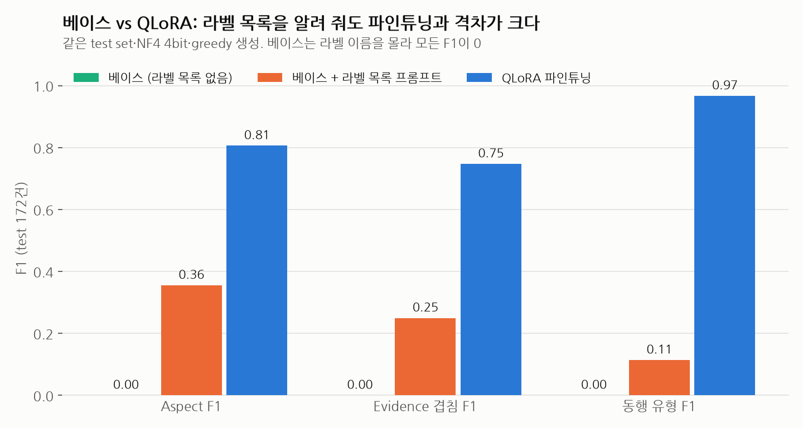

# 베이스 EXAONE vs QLoRA 파인튜닝 비교 (2026-09-29)

**한 줄 결론**: 파인튜닝 효과가 분명하다. 베이스 모델에 라벨 목록을 알려 줘도 Aspect F1이 0.355에 그치지만, QLoRA는 0.806이다. 파인튜닝은 라벨 이름만 외운 것이 아니라 **리뷰에서 무엇을, 어떤 근거로 뽑는지**를 학습했다.

| 조건 | Aspect F1 | Evidence 겹침 F1 | 동행 유형 F1 | Schema Valid | GPT Judge Pass (172건) |
| --- | --- | --- | --- | --- | --- |
| 베이스 (라벨 목록 없음) | 0.000 | 0.000 | 0.000 | 1.2% | 16.3% |
| 베이스 + 라벨 목록 프롬프트 | 0.355 | 0.250 | 0.114 | 28.5% | — |
| **QLoRA 파인튜닝** | **0.806** | **0.747** | **0.967** | **98.3%** | **37.8%** |



---

## 1. 비교 조건

세 조건은 **모델 가중치와 프롬프트만** 다르고 나머지는 모두 같다.

| 항목 | 공통 조건 |
| --- | --- |
| 베이스 모델 | `LGAI-EXAONE/EXAONE-3.5-2.4B-Instruct` (revision `ccce25b`) |
| 정밀도 | 셋 다 **NF4 4bit**. 차이가 어댑터(파인튜닝) 유무에서만 나오도록 맞췄다 |
| 생성 | greedy(`do_sample=False`), 최대 384 토큰, 8건 배치 |
| Test set | Gold 172건 (호텔 53 · 식당 65 · 관광지 54, 모두 합성 리뷰) |
| 자동 지표 | 같은 `evaluation/metrics.py` (엄격·정규화·겹침 Evidence 지표 포함) |

| 조건 | 모델 | 프롬프트 |
| --- | --- | --- |
| 베이스 | 어댑터 없음 | 학습 때와 같은 시스템 프롬프트 |
| 베이스 + 라벨 목록 | 어댑터 없음 | 위 프롬프트 + 카테고리별 허용 aspect·attribute, 동행 유형·감성 허용 값 |
| QLoRA | 최적 체크포인트(step 400) 어댑터 | 학습 때와 같은 시스템 프롬프트 |

> 💡 **베이스라인**: 비교의 기준이 되는 조건. 학습 프롬프트에는 라벨 이름 목록이 없어서, 베이스 모델은 이름을 알 방법이 없다. 그래서 이름을 알려 준 "베이스 + 라벨 목록" 조건을 공정한 기준으로 추가했다.
> 💡 **NF4 4bit**: 모델 가중치를 4비트로 압축해 불러오는 방식. QLoRA 평가와 같은 정밀도로 맞추고, 8GB GPU에 올리기 위해 베이스도 4bit로 불러왔다.

---

## 2. 자동 평가 지표 (test 172건)

| 지표 | 베이스 | 베이스 + 라벨 목록 | QLoRA |
| --- | --- | --- | --- |
| Aspect Precision | 0.000 | 0.400 | **0.828** |
| Aspect Recall | 0.000 | 0.319 | **0.785** |
| **Aspect F1** | 0.000 | 0.355 | **0.806** |
| Evidence 엄격 F1 | 0.000 | 0.114 | **0.580** |
| Evidence 정규화 F1 | 0.000 | 0.152 | **0.659** |
| Evidence 겹침 F1 (IoU ≥ 0.5) | 0.000 | 0.250 | **0.747** |
| 동행 유형 F1 | 0.000 | 0.114 | **0.967** |
| JSON 파싱 성공률 | 98.8% | 100% | 99.4% |
| Schema Validity | 1.2% | 28.5% | **98.3%** |
| Evidence 원문 포함률 | 92.6% | 93.2% | **100%** |
| Record Exact Match | 0% | 0% | **17.4%** |

> 💡 **Precision / Recall / F1**: Precision은 모델이 뽑은 것 중 맞은 비율, Recall은 정답 중 모델이 찾아낸 비율, F1은 둘의 조화평균.
> 참고: 이전까지 JSON 성공률은 파싱에 실패해 빈 라벨로 대체된 경우도 성공으로 세어 100%로 보였다. `evaluation/metrics.py`를 고쳐 실제 파싱 성공만 센다.
> 💡 **Schema Validity**: 출력의 aspect·attribute·감성·동행 유형이 모두 프로젝트 허용 값 안에 있는 리뷰 비율.

### 카테고리별 (베이스 + 라벨 목록 vs QLoRA)

| 카테고리 | 건수 | Aspect F1 | Evidence 겹침 F1 | 동행 유형 F1 |
| --- | --- | --- | --- | --- |
| 호텔 | 53 | 0.333 → **0.820** | 0.259 → **0.787** | 0.263 → **0.985** |
| 식당 | 65 | 0.490 → **0.855** | 0.325 → **0.816** | 0.048 → **0.959** |
| 관광지 | 54 | 0.213 → **0.735** | 0.151 → **0.630** | 0.132 → **0.960** |

- 모든 카테고리에서 QLoRA가 크게 앞선다.
- **관광지가 가장 어렵다.** 두 조건 모두 관광지 점수가 가장 낮다. 걷기 부담·경사·쉴 곳처럼 비슷한 aspect가 많아 구분이 까다롭다.

### 베이스 모델이 틀리는 방식

**베이스 (라벨 목록 없음)**: JSON 형식은 거의 지키지만(파싱 98.8%) 라벨을 스스로 지어낸다.

```json
{"traveler_context": ["남자친구와의 커플 여행", "나인호텔 숙박"],
 "aspects": [{"category": "facilities", "attribute": "overall satisfaction", ...},
             {"category": "location", "attribute": "convenience", ...}]}
```

- `traveler_context`에 문장을 쓰고, aspect 이름을 `facilities`·`location`·`ambiance`처럼 임의로 만든다.
- 그래서 정답 라벨과 이름이 한 번도 맞지 않아 모든 F1이 0이다.

**베이스 + 라벨 목록**: 이름은 알게 됐지만 **어떤 aspect를 고를지**를 모른다.

| 출력 aspect 530개 분류 | 개수 |
| --- | --- |
| 형식상 유효 | 384 (72%) |
| 목록에 없는 aspect 이름 | 77 |
| 허용되지 않은 attribute | 45 |
| 원문에 없는 근거 | 23 |
| 허용되지 않은 감성 | 1 |

- 형식상 유효한 aspect가 384개인데도 F1이 0.355다. 즉 **다른 aspect로 잘못 분류하거나 감성을 틀리는 경우가 많다.**
- 동행 유형 F1은 0.114로, 목록을 줘도 리뷰에서 동행 유형을 거의 찾지 못한다.

---

## 3. GPT Judge (`gpt-5-mini`, 172건 전체)

라벨 목록이 없는 베이스와 QLoRA를 채점했다. (베이스 + 라벨 목록 조건은 Judge를 돌리지 않았다.)

| 항목 | 베이스 | QLoRA |
| --- | --- | --- |
| **Pass Rate** | 16.3% | **37.8%** |
| **평균 점수** | 0.575 | **0.687** |
| 점수 분포 (1.0 / 0.5 / 0.0) | 27 / 141 / 2 | 64 / 105 / 1 |

| 세부 항목 (pass 수 / 172) | 베이스 | QLoRA |
| --- | --- | --- |
| Correctness (정확성) | 29 | **66** |
| Completeness (빠짐없음) | 47 | **88** |
| Evidence grounding (근거 타당성) | 121 | **122** |
| Evidence minimality (근거 간결성) | 78 | **136** |
| Schema adherence (형식 준수) | 140 | **168** |

| 카테고리 | 베이스 Pass / 평균 | QLoRA Pass / 평균 |
| --- | --- | --- |
| 호텔 | 15.1% / 0.580 | **39.6% / 0.704** |
| 식당 | 20.0% / 0.586 | **44.6% / 0.715** |
| 관광지 | 13.0% / 0.556 | **27.8% / 0.635** |

주요 감점 사유: 베이스는 **aspect 누락 128건**·근거 문제 77건·감성 오류 54건, QLoRA는 aspect 누락 78건·attribute 불일치 34건.

> 💡 **Pass Rate**: Judge가 "완벽하다"고 판정한 리뷰 비율. 실수가 하나라도 있으면 pass가 아니다.

### Judge 결과를 읽을 때 주의할 점

- **Judge는 베이스에 관대하다.** Judge 프롬프트에는 허용 라벨 목록이 없어서, `facilities`처럼 지어낸 이름도 뜻이 비슷하면 부분 점수(0.5)를 준다. 형식 준수도 베이스 140/172로 높게 나온다.
- 그래서 **실제 차이는 자동 지표가 더 정확하게 보여 준다.** DB에 저장하고 장소 프로필로 집계하려면 라벨 이름이 정확히 맞아야 하는데, 베이스는 이게 0%다.
- 그래도 Judge로 봐도 QLoRA가 **Pass Rate 2.3배, 정확성 2.3배, 근거 간결성 1.7배**로 앞선다.
- **근거 타당성(grounding)은 비슷하다** (121 vs 122). 베이스도 원문을 인용하는 능력 자체는 어느 정도 있다. 파인튜닝의 이득은 **무엇을 골라 어떻게 분류하느냐**에서 나온다.
- 이번 QLoRA Pass Rate(37.8%)는 지난번 20건(호텔만) 결과 45~50%보다 낮다. 관광지가 가장 약하고, 20건 표본이 작았기 때문이다. **172건 결과를 기준으로 본다.**
- `gpt-5-mini`는 `temperature=0`을 지원하지 않아 실행마다 판정이 조금 흔들린다. 이번 결과는 1회 실행이다.

---

## 4. 종합 판단

| 질문 | 답 |
| --- | --- |
| 파인튜닝이 효과가 있었나? | **있다.** 공정한 베이스라인 대비 Aspect F1 +0.451, Evidence 겹침 F1 +0.497, 동행 유형 F1 +0.853 |
| 라벨 이름만 외운 것인가? | **아니다.** 이름을 알려 준 베이스도 F1 0.355에 그친다 |
| 무엇이 가장 좋아졌나? | 동행 유형 판단(0.11 → 0.97), 근거 범위를 알맞게 자르기(간결성 78 → 136), 스키마 준수(28.5% → 98.3%) |
| 아직 약한 부분은? | aspect 누락(Recall 0.785), 관광지 카테고리(F1 0.735) |

### 한계

1. **Test set이 전부 합성 리뷰**다. 실제 리뷰에서의 격차는 따로 확인해야 한다.
2. **LoRA(4bit가 아닌 16bit 학습) 조건은 아직 비교하지 않았다.** 프로젝트 목표인 Base vs LoRA vs QLoRA 중 Base vs QLoRA만 끝났다.
3. **Judge는 1회 실행**이고, 베이스 + 라벨 목록 조건은 Judge를 돌리지 않았다.
4. 베이스 프롬프트를 더 다듬으면(예시 몇 개를 보여 주는 few-shot) 베이스 점수가 오를 여지가 있다. 이번 비교는 zero-shot 기준이다.

> 💡 **zero-shot / few-shot**: 예시 없이 지시만 주는 방식이 zero-shot, 정답 예시 몇 개를 함께 보여 주는 방식이 few-shot이다.

### 다음 단계

- [ ] LoRA 학습 후 같은 조건으로 추가해 Base vs LoRA vs QLoRA 3자 비교 완성
- [ ] few-shot 베이스라인(예시 3개) 추가로 베이스의 최대 성능 확인
- [ ] 실제 Tripadvisor 리뷰 일부에 사람 라벨을 붙여 실제 리뷰 기준 격차 확인

---

## 부록: 재현 방법

`sang` 브랜치, 저장소 루트에서 실행한다. `evaluation/config.json`에 베이스(4bit)와 QLoRA가 함께 들어 있다.

```bash
# 베이스·QLoRA 추론 + 자동 지표 + GPT Judge (172건 전체)
uv run python -m evaluation.run_pipeline \
  --config evaluation/config.json \
  --out evaluation/runs/2026-09-29-base-vs-qlora

# 공정한 베이스라인: 라벨 목록을 프롬프트에 넣은 베이스 추론
uv run python -m evaluation.schema_prompt_baseline \
  --out evaluation/runs/2026-09-29-base-vs-qlora/extra/exaone_2_4b_base_schema.jsonl
```

| 결과 파일 (git 제외) | 내용 |
| --- | --- |
| `evaluation/runs/2026-09-29-base-vs-qlora/automatic_metrics.json` | 베이스·QLoRA 자동 지표 |
| `evaluation/runs/2026-09-29-base-vs-qlora/extra/metrics_3way.json` | 세 조건 자동 지표 |
| `evaluation/runs/2026-09-29-base-vs-qlora/judge_results.jsonl` | Judge 344건 |
| `evaluation/runs/2026-09-29-base-vs-qlora/predictions/` | 조건별 예측 172건 |
