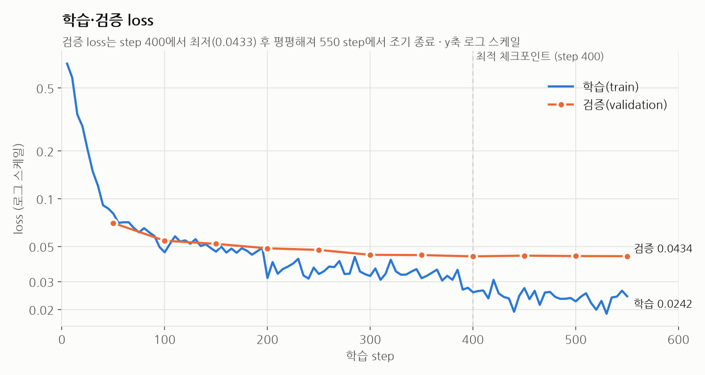
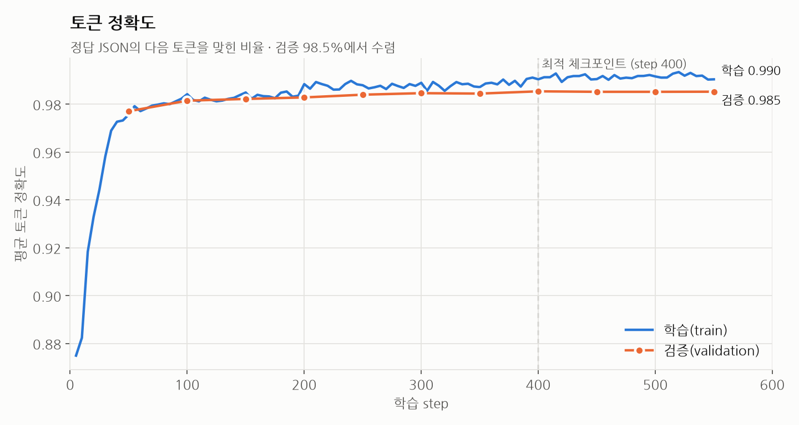
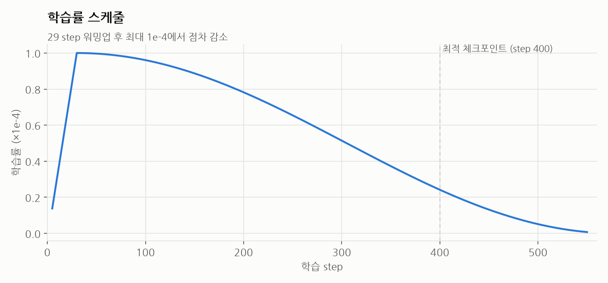
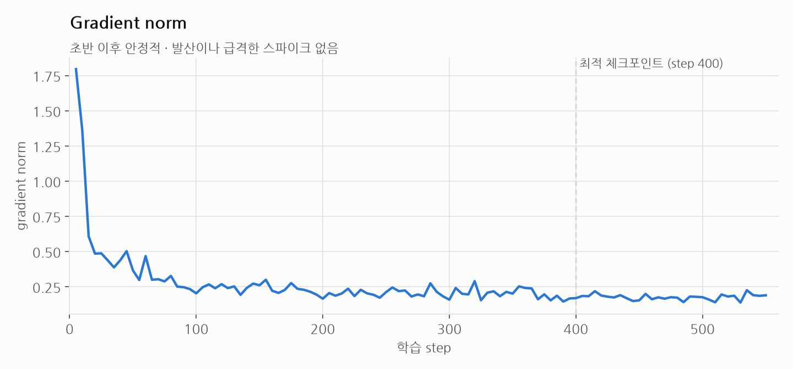

# EXAONE 2.4B QLoRA 리뷰 구조화 모델 평가 (2026-09-29)

**한 줄 결론**: 출력 형식은 거의 완벽하고(JSON 99.4%, 근거 원문 인용 100%), 내용은 리뷰 속 aspect 5개 중 4개 정도를 맞힌다(Aspect F1 0.806). 장소 프로필처럼 여러 리뷰를 모아 쓰는 MVP 용도로는 충분하다. 베이스 모델과의 비교는 [베이스 vs QLoRA 비교](2026-09-29-base-vs-qlora.md)에 정리했다.

| 구분 | 핵심 수치 |
| --- | --- |
| 자동 지표 | Aspect F1 **0.806**, Evidence 겹침 일치 F1 **0.747**, 동행 유형 F1 **0.967**, JSON 성공 **99.4%** |
| GPT Judge (20건) | Pass Rate **0.45~0.50**, 평균 점수 **0.725~0.75**, 완전 오답 **0건** |
| 속도 (단건) | Ollama GGUF **평균 1.4초**/요청 (서비스 경로), Transformers 4bit **11.6초**/요청 |

---

## 1. 평가 대상과 조건

### 모델

| 항목 | 값 |
| --- | --- |
| 베이스 모델 | `LGAI-EXAONE/EXAONE-3.5-2.4B-Instruct` (revision `ccce25b`) |
| 학습 방식 | QLoRA (NF4 4bit + LoRA r=16, α=32, dropout 0.05) |
| 학습 데이터 | train 3,087건 / validation 371건 |
| 학습 설정 | lr 1e-4, 최대 3 epoch, 유효 batch 16, warmup 29 step, max_length 640 |
| 학습 결과 | 550 step에서 종료(계획 579 step), 최고 VRAM 3.2GB, 약 94분 |
| 평가에 쓴 adapter | `adapter/` — **최적 체크포인트(step 400, 검증 loss 0.0433)와 가중치 동일** 확인 |
| 서비스 배포본 | Ollama `hinoonyaso/exaone-tripfit:qlora-v2` (GGUF q4_k_m, 1.5GB) |

> 💡 **QLoRA**: 원본 모델을 4bit로 압축해 메모리를 줄인 상태에서, 작은 LoRA 가중치만 추가로 학습하는 방식이다.
> 💡 **체크포인트**: 학습 중간중간 저장한 모델 상태. 검증 loss가 가장 낮았던 step 400을 최종 모델로 썼다.

### Test set

| 항목 | 값 |
| --- | --- |
| 건수 | **172건** (Gold 100%) |
| 카테고리 | 식당 65 · 관광지 54 · 호텔 53 |
| 리뷰당 평균 aspect 수 | 3.86개 |
| 합성 여부 | **172건 모두 LLM 합성 리뷰** (실제 사용자 리뷰 아님) |

> 💡 **Gold**: 사람이 원문과 대조해 승인한 정답 라벨. Test set은 모든 실험이 공유한다.

---

## 2. 학습 곡선 (W&B run `u623kscn`)

W&B: https://wandb.ai/hinoonyaso-student/tripfit-review-extraction/runs/u623kscn



- 학습 loss는 0.71 → 0.024로 꾸준히 내려갔다.
- 검증 loss는 step 400에서 최저(0.0433)를 찍고 이후 거의 변화가 없다. 학습 loss만 계속 내려가므로, 그 뒤로 더 학습해도 일반화 이득은 없었다.
- 학습·검증 loss의 차이가 크게 벌어지지 않아 **심한 과적합은 없다**.



- 검증 토큰 정확도는 100 step 무렵 98%를 넘기고 **98.5%에서 수렴**했다.



- 29 step 워밍업 후 최대 1e-4에서 코사인 형태로 감소했다.



- 초반 1.8에서 빠르게 0.2 안팎으로 안정됐다. 발산이나 큰 스파이크가 없어 **학습이 안정적**이었다.

> 💡 **loss**: 모델 출력이 정답과 얼마나 다른지를 나타내는 값. 낮을수록 좋다.
> 💡 **과적합**: 학습 데이터만 외워서 처음 보는 데이터(검증)에서는 성능이 오르지 않는 상태.

---

## 3. 자동 평가 지표 (test 172건)

| 지표 | Precision | Recall | F1 |
| --- | --- | --- | --- |
| Aspect (category + attribute + sentiment) | 0.828 | 0.785 | **0.806** |
| Evidence 엄격 일치 | 0.596 | 0.565 | **0.580** |
| Evidence 정규화 일치 | 0.677 | 0.642 | **0.659** |
| Evidence 겹침 일치 (글자 IoU ≥ 0.5) | 0.768 | 0.727 | **0.747** |
| Traveler Context (동행 유형) | 0.975 | 0.959 | **0.967** |

| 지표 | 값 |
| --- | --- |
| JSON 성공률 | **99.4%** (171/172) |
| Schema Validity | **98.3%** (169/172) |
| Evidence 원문 포함률 | **100%** |
| Record Exact Match | **17.4%** |

> 💡 **Precision / Recall / F1**: Precision은 모델이 뽑은 것 중 맞은 비율, Recall은 정답 중 모델이 찾아낸 비율, F1은 둘의 조화평균.
> 💡 **Evidence 정규화 일치**: 앞뒤 공백과 끝 문장부호만 떼고 비교한다.
> 💡 **IoU**: 정답 근거와 예측 근거가 원문에서 겹친 길이 ÷ 두 구간을 합친 길이. 1이면 완전히 같다.

### 해석

- **형식은 완성 단계다.** JSON 99.4%, 스키마 98%, 근거 원문 인용 100%로, 출력이 깨지거나 근거를 지어내는 일이 거의 없다.
- **내용은 "놓치는 쪽"의 오류가 많다.** Precision(0.83)이 Recall(0.78)보다 높다. 리뷰 속 aspect 5개 중 4개 정도를 맞히고, 뽑은 것 6개 중 1개 정도가 틀리거나 정답에 없다.
- **동행 유형은 거의 다 맞힌다** (F1 0.97).
- **Record Exact Match 17%는 낮아 보이지만 정상 범위다.** 리뷰당 aspect가 평균 3.86개이고 근거 문구까지 한 글자도 다르지 않아야 해서 원래 낮게 나오는 지표다.

### Evidence 점수가 떨어지는 이유

Aspect는 맞혔는데 Evidence 엄격 일치에서 틀린 경우를 분류했다 (aspect가 맞은 521쌍 기준).

| 유형 | 비율 | 예시 (정답 → 예측) |
| --- | --- | --- |
| 완전 일치 | **71.2%** | — |
| 끝 마침표·공백만 다름 | 9.8% | `제한적이더라고요.` → `제한적이더라고요` |
| 예측이 더 짧음 | 8.8% | `일단 객실 창밖 뷰가…` → `객실 창밖 뷰가…` |
| 예측이 더 김 | 5.8% | `시설이 좀 낡은…` → `전반적으로 시설이 좀 낡은…` |
| 일부만 겹침 | 0.6% | |
| **아예 다른 구절** | **3.8%** (20건) | `고기 신선도가 좋아서` → `고소한 향이 제대로 나더라고요` |

- 대부분은 **근거를 어디서 자르느냐**의 차이다. 진짜로 엉뚱한 근거를 댄 경우는 3.8%뿐이다.
- 정답 라벨의 경계 기준도 들쭉날쭉하다(마침표 포함 여부, `일단`·`전반적으로` 같은 부사 포함 여부). 경계 가이드라인을 정해 라벨을 정규화하면 엄격 일치 점수도 오를 여지가 크다.
- 그래서 실제 근거 인용 능력은 엄격 일치 0.58보다 **겹침 일치 0.75에 가깝다**고 본다. 다른 모델과 비교할 때는 세 지표를 모두 함께 보고한다.

---

## 4. GPT Judge (`gpt-5-mini`, test 앞 20건)

같은 예측 결과를 두 번 채점했다.

| 항목 | 1차 | 2차 |
| --- | --- | --- |
| **Pass Rate** | 0.45 (9/20) | **0.50** (10/20) |
| **평균 점수** | 0.725 | **0.75** |
| 점수 분포 | 1.0 ×9, 0.5 ×11 | 1.0 ×10, 0.5 ×10 |
| 0.0 (완전 오답) | **0건** | **0건** |

| 세부 항목 (pass 수 / 20) | 1차 | 2차 |
| --- | --- | --- |
| Correctness (정확성) | 9 | 13 |
| Completeness (빠짐없음) | 13 | 12 |
| Evidence grounding (근거 타당성) | 16 | 16 |
| Evidence minimality (근거 간결성) | 18 | 18 |
| Schema adherence (형식 준수) | 19 | 20 |

주요 감점 사유 (error tag): **aspect 누락 7건**(두 번 모두 1위), 정답에 없는 aspect 추가 3~5건, attribute·category 불일치 등.

> 💡 **Pass Rate**: Judge가 "완벽하다"고 판정한 비율. 한 리뷰에 실수가 하나라도 있으면 pass가 아니다.
> 💡 **Evidence grounding**: 제시한 근거가 실제 리뷰에 있고, 고른 aspect를 뒷받침하는지.

### 해석

- 리뷰 절반 정도는 **실수 없이 완벽**하고, 나머지 절반은 **대부분 맞지만 aspect를 한두 개 놓치거나 더한** 부분 정답이다.
- 두 번 모두 **완전히 틀린 리뷰는 0건**이었다.
- 자동 지표와 결론이 같다: 근거·형식은 강하고, 약점은 aspect 누락이다.
- **Judge 자체가 흔들린다.** 모델 출력은 같은데 20건 중 3건의 판정이 바뀌었다. `gpt-5-mini`는 `temperature=0`을 지원하지 않기 때문이다. 수치는 범위(Pass Rate 0.45~0.50)로 읽는다.
- **20건 모두 호텔 리뷰**라 식당·관광지는 아직 Judge로 보지 않았다.

> 💡 **temperature**: 모델이 답을 얼마나 무작위로 고를지 정하는 값. 0이면 매번 거의 같은 답을 낸다.

---

## 5. 추론 속도

모두 RTX 4060 Laptop(8GB) **GPU**에서 측정했다.

| 조건 | 요청당 지연 | 생성 속도 | 비고 |
| --- | --- | --- | --- |
| **Transformers 4bit + adapter, 1건씩** | 평균 **11.6초** (p50 11.3초, p95 18.2초) | **12.7 tokens/s** | test 169건 측정(warmup 3건 제외), 최소 5.3초·최대 35.6초 |
| Transformers 4bit + adapter, 8건 배치 | 16건에 40초 (모델 로딩 포함) | — | 평가 파이프라인 처리량. 1건씩 대비 약 4배 빠름 |
| **Ollama GGUF q4_k_m, 1건씩 (모델 적재 후)** | 평균 **1.4초** (최대 1.9초) | — | 백엔드 `/api/v1/analyze`로 8건 측정. 서비스 경로 |
| Ollama GGUF q4_k_m, 첫 요청 (콜드 스타트) | 5.0~7.5초 | — | 모델을 GPU에 올리는 시간 포함 |

- 평균 출력은 약 147 토큰이다. **지연은 출력 길이에 비례**하므로 aspect가 많은 리뷰일수록 오래 걸린다.
- 1건씩 생성할 때는 GPU 계산보다 **CPU가 GPU에 명령을 보내는 준비 시간**의 비중이 커서 CPU 부하의 영향을 받는다. 이번 측정 도중 다른 작업이 CPU를 함께 써서 **p95·최대값은 실제보다 다소 높게** 나왔을 수 있다. 평균·중앙값 영향은 작다.
- **서비스 기준으로는 Ollama 경로(평균 1.4초)를 본다.** 같은 모델인데 Transformers 4bit보다 약 8배 빠르다. 첫 요청만 모델 적재 때문에 5~7초가 걸린다.

> 💡 **콜드 스타트**: 모델이 메모리에 없어 첫 요청 때 불러오는 시간이 더 드는 현상. Ollama는 모델을 몇 분간 올려 두므로 그다음 요청부터 빠르다.
- 참고: 파인튜닝 전 베이스 모델(`exaone3.5:2.4b`)은 `/analyze` 테스트에서 **정해진 라벨 형식(스키마)을 지키지 못해 422**로 응답했다(1건). 학습으로 출력 형식을 확실히 익혔다는 근거다.

> 💡 **p50 / p95**: 요청을 빠른 순으로 줄 세웠을 때 50%, 95% 지점의 시간. p95 18초는 요청 20개 중 19개가 18초 안에 끝났다는 뜻이다.
> 💡 **warmup**: 처음 몇 건은 GPU 초기화 때문에 느려서 통계에서 뺀다.

---

## 6. 종합 판단

| 영역 | 수준 |
| --- | --- |
| 출력 형식 (JSON·스키마) | ⭐ 거의 완벽 |
| 근거를 지어내지 않음 | ⭐ 거의 완벽 |
| 동행 유형 | ⭐ 매우 좋음 |
| 무엇을 뽑는지 (aspect + 감성) | ✅ 좋음 |
| 근거 범위 | ✅ 괜찮음 (대부분 경계 차이) |
| 리뷰 한 건을 완벽하게 | ➖ 절반 정도 |

**서비스(MVP)에는 쓸 만하다.**
- 장소 프로필은 리뷰 수십 개를 집계하므로 개별 리뷰에서 놓친 aspect는 평균에 묻힌다.
- Precision이 높아 잘못된 내용이 프로필에 섞이는 일이 적다.
- 근거를 지어내지 않아 사용자에게 근거를 보여 줘도 안전하다.

### 한계

1. **Test set이 전부 합성 리뷰**다. 줄임말·오타·긴 사연이 섞인 실제 리뷰에서는 성능이 낮을 수 있다.
2. **비교 대상이 없다.** 프로젝트 핵심인 Base vs LoRA vs QLoRA 중 QLoRA만 측정했다.
3. **Judge는 20건, 호텔만** 봤고, 실행마다 판정이 조금 흔들린다.
4. 속도 측정 중 CPU 간섭이 있어 p95·최대값은 보수적으로 봐야 한다.

### 다음 단계

- [x] 베이스 EXAONE을 같은 조건으로 평가해 파인튜닝 효과를 수치로 확인 → [베이스 vs QLoRA 비교](2026-09-29-base-vs-qlora.md)
- [x] GPT Judge를 172건 전체로 실행 (식당·관광지 포함) → QLoRA Pass Rate 37.8%, 평균 0.687
- [ ] 실제 리뷰 소량(예: 30건)으로 별도 평가
- [ ] Evidence 경계 가이드라인을 정하고 라벨 정규화 검토 (validation set 기준으로 결정)

---

## 부록: 재현 방법

`sang` 브랜치, 저장소 루트에서 실행한다.

```bash
# 자동 지표 + GPT Judge (추론 결과 재사용, 앞 20건만 Judge)
uv run python -m evaluation.run_pipeline \
  --config evaluation/config.json \
  --out evaluation/runs/calibration \
  --judge-limit 20 \
  --skip-inference

# 단건 추론 속도 측정
uv run python -m evaluation.measure_latency \
  --config evaluation/config.json \
  --warmup 3 \
  --out evaluation/runs/2026-09-29/latency.json
```

| 결과 파일 (git 제외) | 내용 |
| --- | --- |
| `evaluation/runs/calibration/automatic_metrics.json` | 자동 지표 |
| `evaluation/runs/calibration/judge_results.jsonl` | Judge 2차 결과 (1차: `judge_results.prev.jsonl`) |
| `evaluation/runs/calibration/predictions/exaone_2_4b_qlora.jsonl` | 모델 예측 172건 |
| `evaluation/runs/2026-09-29/latency.json` | 속도 측정 결과 |
