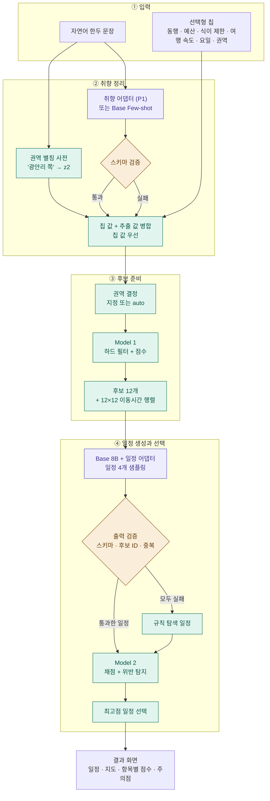
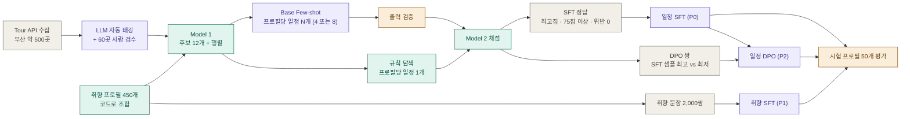

# tripfit 실행 설계 문서 (부산 · 3일 · GPU 1장)

> 이 문서는 대외 계획서 `tripfit_planner_plan.html`을 실제로 실행하기 위한 팀 내부 설계서예요. 계획서와 다른 판단을 한 곳은 **[계획서와 차이]**로 표시했어요.

## 한 줄 정의

> **8B Base 모델의 가중치를 고정한 채 QLoRA 어댑터만 학습해, 사용자 취향과 부산의 후보 장소로 하루 여행 일정을 만드는 지역 특화 AI 여행 플래너.** 규칙 기반 평가기(Model 2)가 모든 일정을 채점하고, 그 점수로 학습 데이터를 선별해요.

## 목표

| 구분 | 목표 |
| --- | --- |
| 서비스 | 취향 입력 → 일정 생성 → 점수·주의점 표시가 끝까지 동작하는 웹 데모 |
| 학습 | 같은 시험 프로필에서 **QLoRA 일정 어댑터가 Base Few-shot보다 좋은 일정을 만든다는 것을 수치와 사람 평가로 증명** |

## 핵심 원칙

> **LLM은 이해하고 제안한다. 코드는 계산하고, 검증하고, 채점한다.**

| 원칙 | 적용 |
| --- | --- |
| LLM 출력은 코드가 검증한다 | JSON 파싱 → 스키마 검증 → 후보 ID 검증 → 중복 검사를 통과해야 채점해요 |
| LLM은 주어진 후보 안에서만 고른다 | Planner는 Model 1이 준 후보 12개의 ID만 사용해요 |
| 수치는 LLM이 만들지 않는다 | 이동시간, 이동 수단, 점수는 코드가 계산해요 |
| 서비스는 멈추지 않는다 | 유효한 LLM 일정이 없으면 규칙 탐색 결과를 반환해요 |

## 우선순위

3일 안에 계획서의 학습 범위를 모두 끝내기 어렵기 때문에 등급을 나눠요.

| 등급 | 산출물 | 미수행 시 대체 |
| --- | --- | --- |
| **P0 필수** | 부산 POI 약 500곳, 권역, Model 1·2, 규칙 탐색, **일정 어댑터 SFT**, 웹 데모 | 없음 (핵심 경로) |
| **P1 조건부** | 취향 어댑터 SFT | Base Few-shot 취향 추출 유지 |
| **P2 조건부** | 일정 어댑터 DPO | SFT 어댑터로 서빙·평가 |

**진입 조건 (9/29):** 일정 SFT 학습과 평가가 13:00까지 끝나면 P1을 시작해요. P2는 P1 수행 여부와 관계없이, 실제 서빙 연결 확인이 끝나고 17:00에 GPU가 비어 있으면 시작해요. 조건을 못 맞춘 항목은 건너뛰고 결과표에 "미수행"으로 적어요.

## 이번 범위

| 만드는 것 | 만들지 않는 것 |
| --- | --- |
| 부산 전체 장소(약 500곳) 기반 하루 일정 (방문지 4~6곳) | 여러 날 일정, 숙소·교통 예약 |
| 권역 선택 (6개 권역, 자동 선택 포함) | 부산 외 지역 |
| 일정 어댑터 SFT (P0), 취향 어댑터 SFT (P1), 일정 어댑터 DPO (P2) | 음성 입력 |
| 텍스트 입력, 템플릿 주의점 | LLM 기반 설명 생성 |
| 직선거리 기반 이동시간과 이동 수단 | 지도 API 기반 실제 이동시간 |

---

# 1. 전체 구조

## 1-1. 서비스 흐름



> 보라색 = LLM, 초록색 = 규칙 코드, 주황색 = 검증 분기. 취향 추출 검증에 실패하면 추출 값을 버리고 칩 값만으로 진행해요.

## 1-2. 학습 흐름



| 구성 요소 | 서비스 흐름 | 학습 흐름 |
| --- | --- | --- |
| Model 1 | 사용자 요청마다 권역 결정과 후보 제공 | 학습 프로필마다 후보 제공 |
| 규칙 탐색 | LLM 실패 시 대체 일정 | 학습 정답 후보, 평가 기준선 |
| Model 2 | 최고점 일정 선택, 점수 표시 | **학습 데이터 선별**, 실험 채점 |
| Base 8B | 취향 추출 (P1 미수행 시) | POI 태깅, 취향 문장 생성, Few-shot 일정 생성 |
| 일정 어댑터 | 일정 생성 | 학습 대상 (SFT, DPO) |
| 취향 어댑터 | 취향 추출 (P1 수행 시) | 학습 대상 (SFT) |

---

# 2. 데이터

## 2-1. 취향 JSON

```json
{
  "companion": ["family"],
  "pace": "relaxed | moderate | packed",
  "walking_tolerance": "low | medium | high",
  "budget": "low | medium | high",
  "dietary_restrictions": ["vegetarian", "no_seafood", "no_pork"],
  "interests": { "nature": "high", "food": "high", "culture": "medium", "shopping": "low" },
  "day_of_week": "mon | tue | wed | thu | fri | sat | sun",
  "zone": "auto | z1 | z2 | z3 | z4 | z5 | z6"
}
```

| 입력 경로 | 필드 | 처리 |
| --- | --- | --- |
| 칩 | `companion`, `budget`, `dietary_restrictions`, `pace`, `day_of_week`(기본 `sat`), `zone`(기본 `auto`) | 그대로 매핑 |
| 자연어 | `walking_tolerance`, `interests` | 취향 어댑터 또는 Base Few-shot 추출 → 스키마 검증 |
| 자연어 | `zone` | 코드의 권역 별칭 사전으로 매칭. 칩에서 `auto`일 때만 적용 |

범주 → 수치 변환은 코드가 해요: `low 0.25`, `medium 0.5`, `high 1.0`, 언급 없음(`null`)은 `0.5`예요.

## 2-2. POI 수집 (Tour API)

부산(`areaCode=6`)에서 아래 분류를 수집해요.

| 분류 | contentTypeId | 목표 수 |
| --- | --- | ---: |
| 관광지 | 12 | 약 200 |
| 문화시설 | 14 | 약 80 |
| 음식점 | 39 (카페 cat3 제외) | 약 150 |
| 카페 | 39 중 카페·전통찻집 cat3 | 약 70 |

| 단계 | 내용 |
| --- | --- |
| 호출 | `areaBasedList` → `detailCommon`(소개글, 좌표) → `detailIntro`(이용시간, 휴무일, 대표메뉴) |
| 제외 | 좌표나 소개글이 없는 장소 |
| 영업시간 | 정규식 `HH:MM~HH:MM`으로 파싱해요. 실패하면 분류별 기본값을 넣고 `parse_status`를 기록해요 |
| 휴무일 | "매주 월요일" 같은 요일 패턴만 파싱해요. 그 외는 `unknown`이고 휴무 없음으로 취급해요 |
| 체류 시간 | Tour API에 없어서 기본값을 써요 |
| 출처 | 공공누리 유형을 사전에 확인하고, 화면 하단에 "한국관광공사 제공"을 표시해요 |

| 분류 | 영업시간 기본값 | 체류 시간 기본값 |
| --- | --- | ---: |
| 관광지 (자연, 야외) | 00:00–24:00 | 90분 |
| 관광지 (기타) | 09:00–18:00 | 60분 |
| 문화시설 | 09:00–18:00 | 90분 |
| 음식점 | 11:00–21:00 | 60분 |
| 카페 | 10:00–21:00 | 45분 |

## 2-3. POI 스키마와 자동 태깅

```json
{
  "id": "poi_001", "name": "해운대해수욕장", "type": "attraction | culture | restaurant | cafe",
  "zone": "z1", "lat": 35.1587, "lng": 129.1604,
  "open": "00:00", "close": "24:00", "rest_days": [], "visit_duration": 90,
  "tags": { "nature": 1, "food": 0, "culture": 0, "shopping": 0,
            "walking_burden": 0.5, "crowd": 1, "indoor": 0 },
  "price_level": 0,
  "diet": { "vegetarian": "unknown", "no_seafood": "unknown", "no_pork": "unknown" }
}
```

| 항목 | 내용 |
| --- | --- |
| 태깅 방식 | Base 8B가 소개글과 대표메뉴를 읽고 `tags` 7속성, `price_level`, `diet`를 JSON으로 출력해요. vLLM 배치로 돌려요 |
| 값 범위 | `tags`와 `price_level`은 0 / 0.5 / 1 세 단계, `diet`는 `yes` / `no` / `unknown` |
| 사람 검수 | 60곳을 1인 12곳씩 기준표로 직접 태깅해요. 사전에 5곳을 전원이 함께 태깅해 기준을 맞춰요 |
| 합격 기준 | 속성별 3단계 정확 일치 80% 이상 |
| 미달 시 | 해당 속성 프롬프트를 1회 수정하고 재태깅해요. 그래도 미달이면 그대로 쓰고 결과 문서에 한계로 적어요 |
| `indoor` | 저장하고 장소 상세에 표시만 해요. 채점에는 쓰지 않아요 |

Tour API에는 가격과 식이 정보가 없어서 **`price_level`과 `diet`는 LLM 태깅이 유일한 출처**예요. 그래서 하드 필터는 `diet`가 확실히 `no`일 때만 적용하고, `unknown`은 감점으로만 처리해요.

## 2-4. 권역

구·군 단위로 묶은 관광 권역 6개예요.

| ID | 권역 | 구·군 | 별칭 예 |
| --- | --- | --- | --- |
| z1 | 해운대·기장 | 해운대구, 기장군 | 해운대, 송정, 달맞이, 기장 |
| z2 | 광안리·수영 | 수영구, 남구 | 광안리, 민락, 이기대, 오륙도 |
| z3 | 서면·동래 | 부산진구, 동래구, 연제구, 금정구 | 서면, 전포, 온천장, 범어사 |
| z4 | 원도심·영도 | 중구, 동구, 영도구 | 남포, 자갈치, 초량, 태종대 |
| z5 | 송도·다대포 | 서구, 사하구 | 송도, 감천, 다대포 |
| z6 | 서부산·북부 | 강서구, 북구, 사상구 | 낙동강, 화명 |

| 상황 | 처리 |
| --- | --- |
| `zone` 지정 | 해당 권역에서 후보를 찾아요 |
| `zone = auto` | 권역마다 하드 필터 후 상위 12곳(음식점 3곳 이상)의 점수 합을 구해 최댓값 권역을 골라요 |
| 후보 부족 | 12곳 또는 음식점 3곳이 안 되면 **인접 권역표** 순서대로 권역을 합쳐요 |

C가 권역 정의표와 함께 인접 권역표와 별칭 사전을 작성해요.

## 2-5. 이동시간과 이동 수단

| 항목 | 규칙 |
| --- | --- |
| 거리 | 좌표 직선거리 × 1.3 |
| 도보 | 1.0km 이하면 도보(4km/h). `walking_tolerance = low`면 0.6km 이하만 도보 |
| 차량 | 그 외는 20km/h + 고정 5분 |
| Planner 입력 | 12×12 **분 행렬만** 전달해요 |
| 이동 수단 | 코드가 계산해 화면에만 표시해요 ("도보 8분", "차량 6분") |

## 2-6. 전체 데이터 목록

| 데이터 | 규모 | 만드는 방법 | 용도 | 담당 |
| --- | --- | --- | --- | --- |
| 부산 장소 | 약 500곳 | Tour API 수집 + 파싱 | 후보 선정 | C |
| 장소 특징 | 500곳 × (7속성 + 가격 + 식이) | Base 8B 자동 태깅 | 후보 점수 | A (GPU), C (프롬프트) |
| 태깅 검수 | 60곳 | 팀원 직접 태깅 | 정확도 확인 | 전원 |
| 관광공사 코스 | 부산 코스 전체 | Tour API 여행 코스 수집 | 채점 검증, Few-shot 예시 | C |
| 취향 프로필 | 학습 400 + 시험 50 | 코드로 조합 (2-7) | 학습·평가 입력 | B |
| 취향 문장 | 약 2,000쌍 | Base 8B 생성 | 취향 어댑터 학습 (P1) | B (프롬프트), A (GPU) |
| 일정 원본 | 2,000~3,600개 | Base Few-shot 400 × N(4 또는 8) + 규칙 탐색 400 | 선별 재료 | A, D |
| 일정 정답 | 300~400개 | 선별 규칙 | 일정 SFT | D |
| 비교 쌍 | 최대 400쌍 | SFT 어댑터 on-policy 샘플에서 최고 vs 최저 (4-3) | 일정 DPO (P2) | D |
| 채점 검증 세트 | 20세트 × 3개 | 품질이 다른 일정 3개에 팀원 2명씩 순위 | 채점 검증 | B |
| 취향 시험 문장 | 30개 | 팀원 작성 + 교차 확인 라벨 | 취향 평가 | E |
| 블라인드 비교 | 20쌍 | 학습 전 vs 학습 후, 출처 가림 | 최종 평가 | B |

**유의사항:** 시험 프로필 50개는 처음에 떼어 두고 학습 데이터에 절대 섞지 않아요.

합성 데이터 생성 방법의 근거는 `docs/research/2026-09-26-synthetic-training-data.md`에 정리했어요.

## 2-7. 취향 프로필 생성

**생성 순서**

| 순서 | 할 일 | 규칙 |
| --- | --- | --- |
| 1 | 시험 50개 먼저 생성 | pace × walking 9칸에 6개씩 5칸, 5개씩 4칸. 시드 1,000개로 뽑아 **값 쌍(pairwise) 커버리지가 가장 높은** 시드를 고정해요. 권역 z1~z6은 각 3개 이상, 요일은 각 4개 이상 |
| 2 | 학습 400개 생성 | 9칸에 44~45개씩 할당하고 나머지 필드는 아래 분포로 무작위예요. 시험 프로필과 모든 필드가 같으면 다시 뽑아요 |
| 3 | 실행 가능성 검사 | Model 1이 나오는 9/28 오후에 돌려요. 후보 12개 미만이거나 식이 조건을 만족하는 음식점이 3곳 미만이면 같은 칸 안에서 다시 뽑고, 탈락률을 기록해요 |
| 4 | 고정 | `data/profiles/{train,test}.jsonl`에 시드와 함께 저장해요. 이후 모든 단계는 이 파일만 읽어요 |

무작위로 뽑으면 400개는 값 쌍을 거의 다 덮지만, 50개는 약 86%만 덮어요. 그래서 시험셋만 커버리지 기준으로 골라요.

**필드 분포 (출발값)**

| 필드 | 분포 |
| --- | --- |
| pace × walking | 9칸 균등 |
| companion, budget | 균등 |
| dietary_restrictions | 없음 60%, 나머지 3종 균등 |
| interests | 4개 독립 균등. 단, 4개가 모두 같은 값인 프로필은 10% 이하 |
| day_of_week | 토·일 각 20%, 평일 각 12% |
| zone | auto 50%, z1~z6 각 약 8.3% |

**조합 제약:** 논리적으로 불가능한 조합(식이 제한에 "없음"과 다른 값이 함께 있음)만 막아요. 가족 + 빡빡 + 많이 걷기처럼 드물지만 가능한 조합은 전체의 5% 이하로만 제한해요. 실제 사용자도 입력할 수 있기 때문이에요.

**누수 방지**

| 경로 | 규칙 |
| --- | --- |
| 채점 검증 세트 (3-4) | 학습 프로필에서만 뽑아요 |
| Few-shot 예시 | 관광공사 코스만 써요 |
| 취향 문장 (P1) | 학습 프로필 400개로만 만들어요 |

---

# 3. 구성 요소

## 3-1. Model 1 · POI Ranker (규칙 기반)

| 단계 | 내용 |
| --- | --- |
| 하드 필터 | `price_level`이 `budget` 수치보다 높은 곳, 식이 제한에 대해 `diet`가 `no`인 음식점, `day_of_week`가 `rest_days`에 있는 곳 |
| 점수 | 관심사 일치 합 − 걷기 부담 불일치 − 혼잡 감점 − 식이 `unknown` 감점 |
| 혼잡 감점 | `pace = relaxed`이거나 동행에 가족·아이·부모님이 있을 때만 `crowd` 값으로 감점해요 |
| 후보 | 선택된 권역에서 상위 12곳, 음식점 3곳 이상 |
| 출력 | 후보 12개, `ids`, 12×12 이동시간 행렬 |

```json
{
  "zone": "z1",
  "candidates": [
    { "id": "poi_001", "type": "attraction", "visit_duration": 90, "open": "00:00", "close": "24:00", "score": 0.92 }
  ],
  "ids": ["poi_001", "poi_014", "..."],
  "travel_minutes": [[0, 12, 25], [12, 0, 18], [25, 18, 0]]
}
```

후보를 12개로 제한하는 이유는 Planner 입력을 2,048 토큰 안에 두기 위해서예요. 장소 상세 화면의 "추천 이유"는 점수 항목별 기여도로 표시해요.

## 3-2. LLM Planner (일정 어댑터)

| 항목 | 내용 |
| --- | --- |
| 입력 | 취향 JSON + 후보 12개 + 이동시간 행렬 |
| 출력 | 하루 일정 JSON (방문지 수: relaxed 4, moderate 5, packed 6) |
| 생성 | 서비스는 temperature 0.7로 4개 샘플링, 평가는 greedy 1개 |
| 검증 | JSON 파싱, 스키마, 모든 ID가 후보 안에 있는지, 중복 방문이 없는지 |

```json
{ "stops": [
  { "poi": "poi_001", "start": "10:00" },
  { "poi": "poi_014", "start": "12:00" },
  { "poi": "poi_032", "start": "14:00" },
  { "poi": "poi_040", "start": "16:00" }
]}
```

## 3-3. 규칙 탐색 (대체 일정 · 학습 정답 후보)

| 단계 | 내용 |
| --- | --- |
| 1 | Model 1 상위 8개에서 방문지 수만큼 조합을 모두 만들어요 (예: 8개 중 5개 = 56가지) |
| 2 | 각 조합을 최근접 이웃 순서로 배치하고, 10:00 출발로 시작 시각을 순차 배정해요 |
| 3 | Model 2로 모두 채점해 최고점 1개를 반환해요 |

## 3-4. Model 2 · Itinerary Evaluator (규칙 기반)

| 항목 | 계산 | 가중치 |
| --- | --- | ---: |
| Preference Fit | 방문지 Model 1 점수 평균 | 0.35 |
| Route Efficiency | 총 이동시간, 30분 초과 구간 감점 | 0.20 |
| Time Feasibility | 이동 + 체류 + 식사, 영업시간·휴무일·시간 정합성·식사 규칙 위반 감점 | 0.20 |
| Pace | 방문지 수와 총 이동시간이 `pace`와 맞는지 | 0.15 |
| Diversity | 같은 분류 3곳 이상 연속 시 감점 | 0.10 |

| 규칙 | 내용 |
| --- | --- |
| 하루 범위 | 09:00–21:00 |
| 시간 정합성 | 각 방문지의 `start`는 이전 방문지 종료 + 이동시간 이후여야 해요 |
| 식사 | 일정이 12:00에 걸치면 11:00–13:30에 시작하는 음식점 1곳, 18:30에 걸치면 저녁 음식점 1곳 |

```json
{
  "scores": { "preference": 88, "route": 71, "time": 82, "pace": 74, "diversity": 85 },
  "total": 80,
  "violations": [ { "type": "long_transfer", "segment": "poi_032→poi_040", "minutes": 45 } ]
}
```

### 채점 검증

평가기를 믿을 수 있는지 두 기준으로 확인해요. 둘 다 통과해야 학습 데이터 선별에 써요.

| 기준 | 방법 | 통과 |
| --- | --- | --- |
| 사람 순위 | 학습 프로필로 만든 20세트 × 일정 3개, 팀원 2명씩 순위 | Spearman 0.6 이상 |
| 관광공사 코스 | 모든 장소가 DB에 있고 4–6곳인 코스를 10:00 출발로 시간 배정해 채점 | 코스의 70% 이상이 같은 권역 무작위 일정 10개의 중앙값보다 높음 |

관광공사 코스는 취향 프로필이 없어서 코스 유형으로 프로필을 정해요.

| 코스 유형 | 프로필 |
| --- | --- |
| 가족 | `companion: family`, `pace: relaxed`, `walking_tolerance: low` |
| 힐링 | `pace: relaxed` |
| 도보 | `pace: packed`, `walking_tolerance: high` |
| 맛 | `interests.food: high` |
| 나홀로 | `pace: moderate` |

미달이면 D가 가중치를 1회 수정하고 재계산해요.

## 3-5. 주의점 (템플릿)

| 위반 유형 | 템플릿 |
| --- | --- |
| `long_transfer` | "{A}에서 {B}까지 이동이 {n}분으로 길어요." |
| `closed` | "{A}는 {시간}에 영업을 하지 않아요." |
| `rest_day` | "{A}는 {요일}에 쉬는 날이에요." |
| `time_conflict` | "{A}에 도착하기 전에 방문 시각이 잡혀 있어요." |
| `missing_meal` | "{점심/저녁} 시간에 식사할 곳이 없어요." |
| `time_overflow` | "일정이 {시각}에 끝나 너무 늦어요." |
| `over_pace` | "여유로운 일정을 원하셨는데 방문지가 {n}곳이에요." |

---

# 4. 학습

## 4-1. 일정 어댑터 SFT (P0)

**원본 생성:** 학습 프로필 400개마다 일정을 만들어요.
- Base Few-shot N개 (temperature 0.7, vLLM `n=N` 배치)
- 규칙 탐색 1개

Few-shot 예시 2개는 채점 상위 관광공사 코스를 Planner 입력·출력 형식으로 변환해서 써요.

**N 결정 (9/28 오후 10개 시험 실행):** 샘플 1개가 채택되는 비율 p(검증 통과 · 75점 이상 · 위반 0)를 재요.
- p ≥ 0.25이면 N=4
- p < 0.25이면 **처음부터 N=8**

예를 들어 p=0.2이면 프로필당 정답이 나올 확률이 N=4일 때 59%, N=8일 때 83%예요. 나중에 재생성하는 것보다 처음부터 8개를 만드는 편이 GPU 시간이 적게 들어요.

**선별 규칙**
1. 출력 검증을 통과하지 못한 일정은 버려요.
2. **방문지 집합이 같은 샘플은 1개로 합쳐요.**
3. 프로필마다 Model 2 총점이 가장 높은 일정 1개를 고르되, **총점 75 이상 · 위반 0건**일 때만 채택해요.
4. 탐색 결과와 최고 LLM 샘플이 모두 기준을 넘고 점수 차가 **3점 이내면 LLM 샘플**을 골라요. 규칙 탐색은 Model 2 점수를 직접 최대화하므로 채점기의 허점을 가장 많이 이용하는 출처이기 때문이에요.
5. 정답 JSON은 모두 같은 코드로 다시 직렬화해요(키 순서, 공백, `HH:MM`). 출처에 따른 표면 차이를 없애기 위해서예요.
6. 300개 미만이면 먼저 **프로필당 두 번째 정답**(방문지 집합이 다르고 기준 통과)을 추가하고, 그래도 부족하면 기준을 70점으로 낮춰요.
7. 채택된 일정의 출처 비율(Few-shot / 탐색)을 기록해 결과 문서에 적어요.
8. B가 선별된 정답 20개를 직접 보고 "점수는 높은데 이상한 일정"이 있는지 확인해요 (20분).

검증 분할(10%)은 프로필 단위로 나눠요.

**포맷:** 한 줄에 한 샘플인 chat JSONL이에요. Few-shot 예제 없이 서비스 추론 때와 **같은 포맷**으로 학습하고, loss는 assistant 토큰에만 걸어요.

```json
{"messages": [
  {"role": "system", "content": "후보 POI 안에서만 하루 여행 일정을 JSON으로 만든다. 이동시간 행렬을 참고해 동선을 짧게, 영업시간과 여행 속도를 지키고 식사 시간에 음식점을 넣는다."},
  {"role": "user", "content": "{\"preference\": {...}, \"candidates\": [...], \"ids\": [...], \"travel_minutes\": [[...]]}"},
  {"role": "assistant", "content": "{\"stops\": [{\"poi\": \"poi_001\", \"start\": \"10:00\"}, ...]}"}
]}
```

## 4-2. 취향 어댑터 SFT (P1)

| 항목 | 설계 |
| --- | --- |
| 데이터 | 프로필 → 문장 약 2,000쌍. Base 8B가 생성해요 |
| 생성 방식 | **라벨 먼저:** 코드가 "문장 명세"(언급 필드·값·표현 유형·말투·길이·페르소나)를 먼저 만들고, LLM은 문장만 써요 |
| 언급 필드 | 1개 40% / 2개 40% / 3개 20%. 5개 필드가 언급되는 횟수를 균등하게 맞춰요 |
| 표현 유형 | 직접 40% / 간접 40% / 부정 20%. **간접은 low/high만** 쓰고 medium은 직접으로만 표현해요. 부정의 30%는 부정 형태로 high/medium을 말하게 해요("바다는 절대 빼면 안 돼요"). 이중 부정은 제외해요 |
| 다양성 | 말투(해요체/반말/메모체) × 길이(1/2문장)를 균등하게 할당해요. 페르소나는 프로필의 동행·요일로 만들어요. 예시는 팀원이 쓴 60문장 풀에서 명세마다 무작위 2개를 넣어요 |
| 디코딩 | T 0.9, top_p 0.95, `n=2`, 시드 고정. 명세는 목표의 1.5배(3,000개)를 만들어요 |
| 정답 라벨 | 언급한 필드만 값을 넣고, 언급하지 않은 필드는 `null`이에요 |
| 출력 스키마 | `{"walking_tolerance": ..., "interests": {...}}`. `zone`은 별칭 사전이 담당해서 넣지 않아요 |
| 필터 ① 형식 | 5~80자, 줄바꿈 없음, 라벨 누출 단어(`walking`, `high`, `null`, 점수 숫자 등) 없음 |
| 필터 ② 부정 검사 | 부정 유형은 부정 형태소(안, 않, 없, 싫, 별로, 말고, 빼고, 못, 절대)를 포함해야 해요 |
| 필터 ③ 라벨 확인 | Base 8B에 **문장 + 라벨**을 주고 필드마다 `맞음/틀림/언급없음`을 vLLM `choice`로 강제해요. 직접·간접은 불일치 시 폐기하고, **부정은 사람 검수 대기열**로 보내요. Base가 추출하게 하지 않는 이유는 Base Few-shot 추출이 P1의 비교 대상이라, Base가 맞히는 쉬운 문장만 남기 때문이에요 |
| 필터 ④ 중복 | 완전 중복 제거 후, 같은 라벨 안에서 문자 3-gram Jaccard 0.7 이상이면 하나만 남겨요 |
| 사람 검수 | B가 무작위 100개 + 부정 대기열 최대 100개를 검수해요. 유형별 오류가 20%를 넘으면 프롬프트를 수정하고 재생성해요. 한 유형의 필터 탈락률이 40%를 넘으면 탈락 문장 30개를 사람이 확인해요 |
| 분할 | **프로필 단위로** 학습 1,800 / 검증 200 |

## 4-3. 일정 어댑터 DPO (P2)

| 항목 | 설계 |
| --- | --- |
| on-policy 샘플 | 9/29 15:00–17:00 서빙 창에서 SFT 어댑터(`itin`)로 학습 프로필 400개 × `n=4`(T 0.7)를 생성해요. Base 샘플은 SFT가 이미 거의 만들지 않는 실수라 밀어내도 효과가 작기 때문이에요 |
| 후보 | SFT 샘플 4개(검증 통과만) + 기존 SFT 정답 1개. 모두 같은 코드로 JSON을 정규화해요 |
| chosen | 후보 중 최고점, 75점 이상 · 위반 0. 3점 이내면 SFT 샘플을 우선해요 |
| rejected | **SFT 샘플 중** 최저점. 검증 통과 필수 |
| 쌍 조건 | 점수 차이 15점 이상, **방문지 집합이 같은 쌍은 제외**. 비슷한 쌍은 chosen 확률까지 떨어뜨릴 수 있어요 |
| 부족 시 | 쌍이 150개 미만이면 Base 최저점을 rejected로 쓴 쌍으로 채우고 출처별 개수를 기록해요 |
| 손실 | `loss_type=["sigmoid","sft"]`, `loss_weights=[1.0, 1.0]`. DPO에 NLL 항을 더해 chosen 확률 하락을 막아요 (Iterative RPO 방식) |
| reference | SFT 어댑터를 학습 가능 상태로 로드하고 `ref_model=None`, `precompute_ref_log_probs=True`로 둬요 |
| 0단계 확인 | 첫 스텝에서 `rewards/chosen`·`rewards/rejected`가 약 0, loss가 약 0.693이어야 ref가 SFT예요. 크게 벗어나면 멈추고 TRL 버전을 확인해요 |
| 학습 중 감시 | `logps/chosen`이 계속 떨어지거나 `rewards/accuracies`가 처음부터 1.0에 붙으면 쌍 구성을 다시 봐요 |
| 출력 | 별도 어댑터 `itin-dpo` |
| 한계 | 서빙은 bf16, 학습은 4bit라 완전한 on-policy는 아니에요. 부족분은 off-policy예요. 결과 문서에 적어요 |

## 4-4. 학습 설정 (출발값)

| 항목 | 일정 SFT | 취향 SFT | 일정 DPO |
| --- | --- | --- | --- |
| Base 모델 | Qwen 계열 8B Instruct, 가중치 고정 | 같음 | 같음 |
| 양자화 | 4bit NF4, double quantization, 연산 bf16 | 같음 | 같음 |
| LoRA r / alpha / dropout | 16 / 32 / 0.05 | 같음 | SFT 어댑터 이어서 학습 |
| target modules | q, k, v, o, gate, up, down proj | 같음 | 같음 |
| learning rate | 2e-4, cosine, warmup 3% | 2e-4 | 1e-5, beta 0.1 |
| 손실 | assistant 토큰만 (`assistant_only_loss=True`) | 같음 | `["sigmoid","sft"]` |
| epoch | 3 | 2 | 1 |
| batch | 기기당 2 × accumulation 8 | 같음 | 같음 |
| max length | 2,048 | 512 | 2,048 |
| 검증 | 학습 데이터 10%로 validation loss | 검증 200개 | 쌍 10% |

위 값은 튜닝값이 아니라 출발점이에요. 사전 준비의 시험 학습으로 시간과 메모리를 실측해 조정해요.

**학습 전 확인**
- TRL `SFTConfig`·`DPOConfig`의 `max_length` 기본값은 1024이고 뒤쪽을 잘라요. 그대로 두면 assistant JSON이 잘리므로 **2,048을 명시**하고, 학습 전에 데이터의 최대 토큰 길이를 출력해 확인해요.
- `assistant_only_loss=True`는 첫 배치의 라벨 마스크를 출력해서 assistant 부분만 학습되는지 확인해요.
- Base가 Qwen3 계열이면 생성·학습·서빙·평가 모두 `enable_thinking=False`로 통일해요. 한 곳이라도 다르면 형식 통과율이 흔들려요.

```python
from transformers import BitsAndBytesConfig
from peft import LoraConfig

bnb_config = BitsAndBytesConfig(
    load_in_4bit=True,
    bnb_4bit_quant_type="nf4",
    bnb_4bit_use_double_quant=True,
    bnb_4bit_compute_dtype="bfloat16",
)

lora_config = LoraConfig(
    r=16,
    lora_alpha=32,
    lora_dropout=0.05,
    target_modules=["q_proj", "k_proj", "v_proj", "o_proj",
                    "gate_proj", "up_proj", "down_proj"],
    task_type="CAUSAL_LM",
)
# TRL SFTTrainer / DPOTrainer로 학습하고, assistant 토큰에만 loss를 적용해요.
```

---

# 5. 평가

## 5-1. 일정 평가

시험 프로필 50개에서 **greedy로 1개(k=1)**를 생성해 비교해요. 재현성을 위해서예요. Base Few-shot은 데이터 생성 때와 같은 Few-shot 프롬프트를 써요.

| 조건 | 평균 총점 | 위반률 | 형식 통과율 | 후보 밖 ID | 사람 선호 |
| --- | --- | --- | --- | --- | --- |
| 규칙 탐색 (기준선) | | | | | 해당 없음 |
| Base Few-shot | | | | | |
| + SFT | | | | | |
| + SFT + DPO (P2 수행 시) | | | | | |

| 지표 | 목표 |
| --- | --- |
| 평균 총점 | SFT > Base Few-shot, SFT + DPO ≥ SFT |
| 위반률 | 학습 후 < Base Few-shot |
| 형식 통과율 | 98% 이상 |
| 사람 블라인드 비교 | 20쌍 중 11쌍 이상에서 학습 후 일정 선호 |

**블라인드 비교:** Base Few-shot과 최종 서빙 어댑터(DPO 수행 시 DPO, 아니면 SFT)의 일정을 시험 프로필 20개에서 뽑아요. 출처를 가리고 5명이 모두 평가한 뒤 쌍마다 다수결로 정해요.

평가기로 고른 데이터로 학습했기 때문에 평가기 점수만으로는 "실제로 좋아졌는지"와 "점수 받는 요령만 배웠는지"를 구분할 수 없어요. 그래서 사람 블라인드 비교를 함께 해요.

## 5-2. 취향 평가 (P1 수행 시)

| 항목 | 내용 |
| --- | --- |
| 시험 세트 | 팀원이 쓴 직접·간접·부정 표현 30문장. 작성자가 라벨을 달고 다른 1명이 교차 확인해요 |
| 지표 | 언급 필드 정확도, 언급하지 않은 필드의 오추출률 |
| 목표 | 취향 어댑터가 Base Few-shot보다 언급 필드 정확도가 높을 것 |

---

# 6. 서빙과 인프라

## 6-1. LLM 서빙

| 항목 | 내용 |
| --- | --- |
| 서버 | vLLM OpenAI 호환 서버 |
| Base | Qwen 계열 8B Instruct **bf16** (약 16GB). 메모리가 부족하면 bitsandbytes 4bit로 전환 |
| 어댑터 | `enable_lora`, `max_loras=2`, 이름 `pref`, `itin` |
| 요청 흐름 | `/api/plan` 하나에 `pref` 1회(P1 미수행 시 Base Few-shot) + `itin` 샘플 4개 |
| 평가 일관성 | 평가도 같은 서버 설정으로 돌려서, 학습(4bit)과 서빙(bf16)의 차이를 모든 조건에 똑같이 적용해요 |

**[계획서와 차이]** 계획서 도식은 서빙을 "Base 8B (4bit)"로 표시해요. 이 문서는 서빙 품질과 vLLM LoRA 호환성을 위해 bf16을 기본으로 해요.

## 6-2. 백엔드 API (FastAPI)

| 엔드포인트 | 응답 |
| --- | --- |
| `POST /api/plan` | `{preference, zone, stops[{poi, name, start, end, mode, travel_min}], scores, total, violations, messages, source: "llm" \| "search"}` |
| `GET /api/pois/{id}` | 장소 상세 (소개글, 영업시간, 휴무일) + 점수 기여 항목 |
| `GET /api/zones` | 권역 목록과 별칭 |

LLM 호출은 `LLMClient` 인터페이스 뒤에 두고, 실제 vLLM 구현과 **목(mock) 구현**을 둘 다 만들어요. GPU를 학습에 쓰는 동안에는 목 구현으로 개발해요.

## 6-3. 기타

| 항목 | 내용 |
| --- | --- |
| DB | PostgreSQL 테이블 `pois`, `zones`, `zone_adjacency`. 이동시간은 요청마다 12×12로 계산해서 저장하지 않아요 **[계획서와 차이]** |
| 프론트엔드 | Next.js, TypeScript, Tailwind CSS |
| 지도 | Kakao Maps JS SDK. 키는 사전 준비에서 발급해요 |
| 배포 | 프론트엔드는 Vercel, 백엔드와 vLLM은 GPU 서버에서 HTTPS 터널로 노출해요. CORS는 Vercel 도메인만 허용해요 |
| 개발 환경 | 개발은 Windows 10, 학습과 서빙은 24GB 이상 GPU의 Linux |

## 6-4. 재생성 파이프라인

장소 수집부터 학습 데이터 생성까지 명령어 하나로 다시 돌릴 수 있게 만들어요. 채점 기준을 고치면 `score`부터 다시 돌리면 돼요.

```bash
uv run python -m travel_planner.pipeline <stage>
# collect → parse → tag → profiles → candidates → generate → score → select → build
```

- 단계별 결과는 `data/<stage>/*.jsonl`에 저장하고, 이미 있으면 다시 만들지 않아요.
- 무작위 요소는 시드를 고정해요.
- 모든 단계는 10개로 먼저 실행해 오류를 확인한 뒤 전체를 돌려요.

---

# 7. 팀 분담과 일정

## 7-1. 역할

| 역할 | 담당 |
| --- | --- |
| **A · 학습** | GPU 환경, vLLM 배치 추론(태깅·문장·일정), 학습 스크립트, 세 번의 학습, 평가 실행, **GPU 타임라인 관리** |
| **B · 데이터 · 평가** | 프로필 생성, 시험셋 고정, 취향 문장 프롬프트·검수, 채점 검증 운영, 블라인드 비교, 결과표 |
| **C · POI · Model 1** | Tour API 수집·파싱, 권역·별칭·인접표, 태깅 프롬프트와 기준표, Model 1, 후보 API |
| **D · Model 2 · 선별** | Model 2, 출력 검증기, 규칙 탐색, 채점 검증 계산, SFT 선별, DPO 쌍 |
| **E · 서비스** | 입력·결과·상세 화면, 지도, FastAPI, `LLMClient`(mock/vLLM), 어댑터 서빙 연결, 취향 시험 문장, 데모 배포 |

학습(A)과 사람 평가 운영(B)을 분리해 평가의 독립성을 지켜요.

## 7-2. 인터페이스 (사전 준비 때 확정)

| 인터페이스 | 만드는 사람 → 쓰는 사람 |
| --- | --- |
| 취향 JSON 스키마 | B → C, A, D, E |
| POI 스키마, 태깅 기준표, 권역 정의 | C → 전원 |
| 후보 API 출력 (후보 12개 + ids + 행렬) | C → A, D, E |
| Planner 입출력 JSON, 학습 포맷 | A → D, E |
| Model 2 출력 JSON, 위반 유형 | D → A, B, E |
| `/api/plan` 응답 | E → 전원 |

인터페이스가 정해지면 각자 **가짜 JSON**으로 먼저 개발해요.

## 7-3. 사전 준비 (9/26~9/27)

| 담당 | 할 일 | 완료 기준 |
| --- | --- | --- |
| A | GPU 확보, 8B 4bit 로드, vLLM multi-LoRA 동작 확인, 더미 10개로 SFT·DPO 시험 학습 | 학습 시간·메모리 실측값 |
| C | Tour API 키 발급, 수집 스크립트, 권역 정의표 초안, 공공누리 유형 확인 | 부산 데이터 수집 가능 |
| E | Kakao Maps 키 발급, 프로젝트 골격 | 빈 화면 배포 |
| 전원 | 인터페이스 JSON 초안 | 인터페이스 문서 |
| 전원 | 취향 문장 예시 풀: 1인당 유형별 4문장씩 12문장 (20분) | 예시 60문장 |

## 7-4. GPU 타임라인 (1장)

GPU가 1장이라 모든 GPU 작업은 **A가 한 줄로 순서대로** 돌려요. 학습 중에는 vLLM 서버를 내려요.

| 시간 | GPU 작업 | 선행 조건 |
| --- | --- | --- |
| 9/28 11:00–12:30 | POI 500곳 자동 태깅 | C의 수집·파싱 완료 |
| 9/28 14:00–14:30 | 10개 시험 실행 → 채택률 p로 N 결정 | C의 후보 API, Few-shot 예시 |
| 9/28 14:30–17:00 | Base Few-shot 일정 400 × N개 생성 | N 결정 |
| 9/28 17:00–19:00 | 취향 문장 명세 3,000개 × 2 생성 + 라벨 확인 (P1 데이터) | B의 명세·프롬프트, 예시 풀 |
| 9/28 19:00–20:00 | Base Few-shot 시험 50개 평가 생성 | 시험 프로필 고정 |
| 9/29 09:00–12:00 | **일정 SFT 학습** (P0) | 9/28 SFT 데이터 확정 |
| 9/29 12:00–13:00 | SFT 시험 50개 평가 생성 | 일정 SFT 완료 |
| 9/29 13:00–15:00 | 취향 SFT 학습 (P1) | 13:00 진입 조건 |
| 9/29 15:00–17:00 | vLLM 서빙 → E 실제 연결 확인 + **SFT 어댑터로 학습 프로필 400 × 4 샘플 생성 (DPO용)** | — |
| 9/29 17:00–20:00 | 일정 DPO 학습 (P2) | 17:00 진입 조건 |
| 9/30 09:00–11:00 | DPO·취향 평가 생성, 블라인드 쌍 생성 | — |
| 9/30 11:00– | 데모 서빙 고정 | — |

Base 평가를 9/28 저녁에 미리 돌려 두면 학습 전 모델 결과가 9/30 GPU 시간을 쓰지 않아요.

## 7-5. 3일 일정

| 시간 | A | B | C | D | E |
| --- | --- | --- | --- | --- | --- |
| **9/28 오전** | 태깅 배치 실행 | 시험 50개(쌍 커버리지) → 학습 400개 생성, 취향 문장 명세 생성기 | 수집·파싱·권역 매핑 → 11시 넘김 | Model 2·검증기·탐색 (가짜 데이터) | FastAPI·화면 골격, `LLMClient` mock |
| **9/28 오후** | 10개 시험 실행 → N 결정 → Few-shot 일정 생성 | **프로필 실행 가능성 검사**, 채점 검증 세트(학습 프로필), 관광공사 코스 변환, 태깅 검수 60곳 운영 | Model 1, 후보 API (실데이터) | **16시 전원 순위 매김** → Spearman·코스 검증 → 가중치 1회 조정 | 가짜 JSON으로 화면 연결 |
| **9/28 저녁** | 취향 문장 생성·라벨 확인, Base 평가 생성 | 취향 문장 검수(무작위 100 + 부정 대기열), **선별 정답 20개 확인** | 데이터 오류 수정 | 탐색 400·채점·**SFT 선별** | 규칙 탐색 경로로 전체 흐름 연결 |
| **9/29** | 일정 SFT → 평가 → 취향 SFT → 서빙·on-policy 샘플 → DPO | 평가 스크립트, 결과표 초안 | 지도·장소 상세 데이터 | **16시 on-policy DPO 쌍 생성**, 평가 채점 | 15–17시 실제 서빙 연결, 어댑터 교체 |
| **9/30** | DPO·취향 평가 | 블라인드 20쌍 운영·집계, 결과표 | 버그 수정 | 결과표 지원 | 데모 리허설·배포 |

| 날짜 | 완료 기준 |
| --- | --- |
| 9/28 | **학습 데이터 확정** (SFT 300개 이상), 규칙 탐색으로 전체 흐름 동작 |
| 9/29 | 일정 어댑터로 데모 동작 |
| 9/30 | 결과표, 최종 발표 |

**핵심 경로**는 `9/28 오전 수집·태깅 → 16시 채점 검증 → 저녁 선별 → 9/29 오전 일정 SFT`예요. 이 구간이 밀리면 평가와 데모가 모두 밀려요.

## 7-6. 위험과 대응

| 위험 | 신호 | 대응 |
| --- | --- | --- |
| GPU 확보 실패 | 사전 준비에서 4bit 로드 실패 | 9/27 안에 클라우드 GPU로 전환 |
| GPU 작업 지연 | GPU 타임라인에서 1시간 이상 밀림 | P1 데이터 생성 → P1 학습 → P2 순서로 포기 |
| Tour API 수집 지연 | 9/28 11시까지 파싱 미완료 | 관광지·음식점 우선 300곳으로 진행 |
| 자동 태깅 품질 미달 | 속성 일치 80% 미만 | 프롬프트 1회 수정 후 재태깅, 이후 한계로 명시 |
| 채점 코드가 사람 판단과 불일치 | Spearman 0.6 미만 또는 코스 통과율 70% 미만 | 9/28 안에 가중치 1회 수정 후 재계산 |
| 학습 데이터 부족 | 선별 결과 300개 미만 | 프로필당 두 번째 정답 추가 → 기준 70점 → 프로필 추가 생성 순서로 대응 |
| 정답이 탐색에 쏠림 | 탐색 출신이 과반 | 시험 실행의 p로 N을 미리 정하고, 3점 이내면 LLM 샘플 우선. 그래도 과반이면 비율을 결과에 공개 |
| 채점기 과최적화 | 선별 정답 20개 확인에서 이상한 일정 발견 | 해당 규칙을 Model 2에 보완하고 `score`부터 재실행 |
| DPO ref 오설정 | 첫 스텝 `rewards/*`가 0에서 크게 벗어남 | 학습을 멈추고 TRL 버전·ref 어댑터 설정 확인 |
| 권역 후보 부족 | 12곳 또는 음식점 3곳 미만 | 인접 권역 합치기 |
| 학습 중 메모리 부족 | OOM 오류 | 배치 1 × accumulation 16 |
| 통합 지연 | 9/29까지 실제 서빙 연결 실패 | 규칙 탐색 경로로 데모하고, 학습 결과는 결과표로 제시 |

---

# 8. 결정 사항

| 항목 | 결정 |
| --- | --- |
| 대상 지역 | 부산, 관광 권역 6개 |
| 기간 | 2026년 9월 28일 ~ 9월 30일 (3일) + 사전 준비 |
| GPU | 24GB 이상 1장, 모든 GPU 작업 순차 실행 |
| Base 모델 | Qwen 계열 8B Instruct (학습 4bit, 서빙 bf16) |
| 학습 대상 | 일정 SFT (P0), 취향 SFT (P1), 일정 DPO (P2) |
| 장소 데이터 | Tour API 약 500곳, Base 8B 자동 태깅 + 60곳 검수 |
| 예산·식이 | LLM 태깅 `price_level`, `diet`. `no`일 때만 하드 필터 |
| 요일 | 요일 칩 입력 (기본 토요일), 휴무일 필터 |
| 취향 프로필 | 시험 50개를 쌍 커버리지로 먼저 고정, 실행 가능성 검사 통과분만 사용 |
| 학습 데이터 | Few-shot N개(4 또는 8, 시험 실행으로 결정) + 규칙 탐색 1개 중 최고점, 총점 75 이상 · 위반 0 |
| 취향 문장 | 라벨 먼저 생성, 라벨 확인 필터, 3-gram 중복 제거, 프로필 단위 분할 |
| DPO 쌍 | SFT 어댑터 on-policy 샘플 기반, DPO + NLL 손실 |
| 채점 검증 | Spearman 0.6 이상 + 관광공사 코스 70% 통과 |
| 일정 범위 | 하루, 방문지 4~6곳, 09:00–21:00 |
| 후보 수 / 샘플 수 | 후보 12개 / 서비스 샘플 4개 / 평가 greedy 1개 |
| 이동시간 | 직선거리 × 1.3, 1km 이하 도보, 그 외 차량 |
| 입력 | 칩 + 자연어, 칩 값 우선 |
| 설명 | 위반 유형별 템플릿 |
